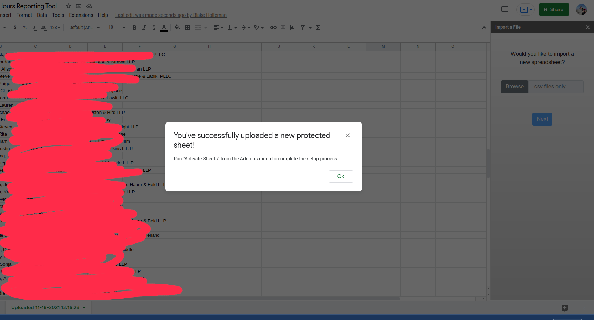
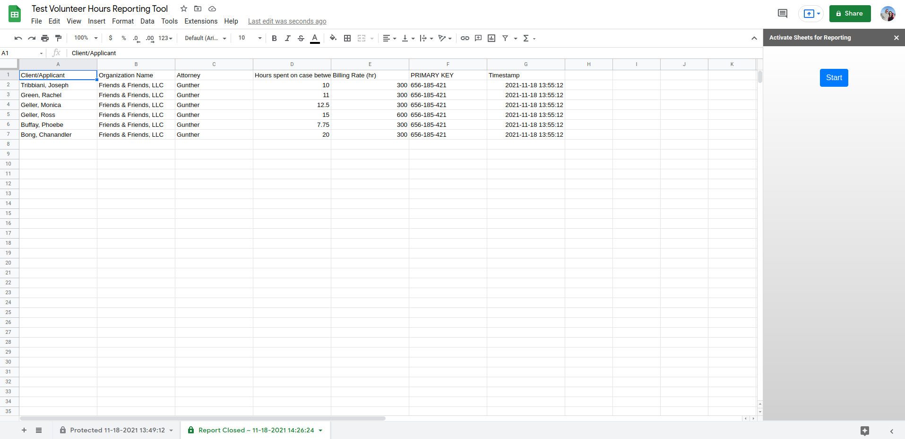
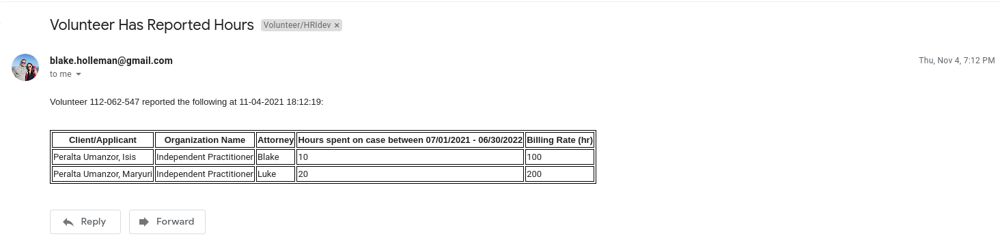

# HRI-vol-tool
<b>Volunteer Hours Reporting Tool built on Google Apps Script</b>

The Volunteer Hours Reporting Tool was designed to simplify volunteer reporting requirements at a small nonprofit with a large volunteer workforce and single adminsitrator. Built on the free Google Apps Script platform, the tool permits volunteers to submit properly formatted data through an authenticated client-side web app, which is then saved and aggregated on an internal Google tracking spreadsheet.  When the volunteer is authenticated, the web app simplifies the reporting process by loading a template of her data from a central repository "protected" sheet on the tracking spreadsheet.  
 

<b>The Tracking Google Spreadsheet</b>

The program runs on the designated tracking spreadsheet as a container-bound script (i.e. unique to a specific spreadsheet instance). When the tracking spreadsheet is opened, the Extensions menu populates with the tool as a custom add-on "Volunteer Reporting Tool":
  

</img>
  

First time use of the tool in a new tracking sheet requires admin authentication and verification. Since the tool is not a publicly registered Google Sheets add-on, a warning from Google will appear.  Click through the link "Go to Volunteer Hours Reporting Tool (unsafe)" to proceed.
  

<table>
  <tr>
    <td></img></td>
    <td></img></td>
  </tr>
</table>
  

<b>Importing Volunteer Data</b>

Volunteer data is imported as a .csv file using the "Import a File" menu item.  This data is then formatted and becomes a new "Uploaded" sheet.  Volunteer data must be imported in this way, and should not be created manually or else formatting issues may create client-side errors.
  

<table>
  <tr>
    <td></img></td>
    <td></img></td>
  </tr>
</table>
  

When creating a new uploaded sheet, the tool automatically assigns each volunteer a unique, nine-digit, personal primary key that is used during client-side login for user authentication purposes. This key is bound to the uploaded sheet and not the individual volunteer, such that the same volunteer may have a different primary key depending on which sheet set as the active reporting sheet (<i>see "Active Reporting Sheets" section</i>).  
 

<table>
  <tr>
    <td></img></td>
    <td></img></td>
  </tr>
</table>
  

<i>Note: Primary keys must be shared with volunteers once a sheet is activated for reporting in order to permit user login to the tool.</i>
  

<b>Active Reporting Sheets</b>

The resulting uploaded sheet must be activated before volunteers can make client-side data requests and report their hours. The "Activate Sheets" menu item creates the central repository "protected" sheet from which the web app pulls volunteer data, as well as a linked "report summary" sheet that aggregates volunteers' submitted responses. An Active sheet may be set from any of the available sheets on the tracking spreadsheet. Active sheets have the following characteristics:
<ul>
  <li>Have edit permissions restricted to the administrator</li>
  <li>Have a unique set of personal primary keys (one per volunteer) that are used for user authentication and verification</li>
  <li>Have <a href="RDMEpics/editprotect1.png">data validation rules set to prevent editing of restricted rows and columns</a> (Primary Keys, Clients, and the header row)</li>
  <li>Have an invalid email filter trigger that notifies the administrator when an email is improperly formatted (columns with email data only)</li>
  <li>Have blue-colored tabs</li>
  <li>Only two active sheets exist at any time (a "protected" sheet and a "report summary" sheet)</li>
</ul>
 

When activating sheets for reporting, the administrator may use the selected sheet's current data settings, i.e. the saved column headings designating particular types of data such as emails and volunteer names; or they may opt to select new data settings.  Finally, the administrator will select which data they wish to display to volunteers for reporting purposes.
  

<table>
  <tr>
    <td></img></td>
    <td></img></td>
  </tr>
</table>
   

<b>Deactivating Sheets</b>

Running the tool's "Activate Sheets" process while active sheets exist will permit the administrator to deactivate those sheets and set a new protected and report summary sheet. This might be done, for instance, to make edits to restricted cells or to activate a new uploaded set of data. Once a sheet is deactivated, its linked report summary sheet is closed for further volunteer submissions.
  

<table>
  <tr>
    <td></img></td>
    <td></img></td>
  </tr>
</table>
  

<i>Note: Take care when deactivating a sheet during active volunteer reporting, as activing a different sheet of volunteer data will establish a different set of primary keys that users will be required to reference at login.  Use the "Update Sheet" feature during the "Activate Sheets" process to keep the currect set of primary keys active and avoid a lapse in client submissions.</i>
  

<b>Email Notifications</b>

The Volunteer Hours Reporting Tool facilitates administrator reponsiveness and data redundancy by sending an automated email to the administrator in the following situations:
<ul>
  <li>Failed user login -- Email to administrator with user email, primary key, and date/time of attempted login</li>
  <li>User volunteer hours submission -- Email to administrator with user primary key, reported data, and date/time of submission</li>
</ul>
  

<table>
  <tr>
    <td></img></td>
    <td></img></td>
  </tr>
</table>
